# ProjetoVaiVoa

<h2>

Artigo sobre API REST que fornece um sistema de geração de número de cartão de crédito virtual.

</h2>

<h3>O diagrama a seguir mostra o design do aplicativo.</h3>

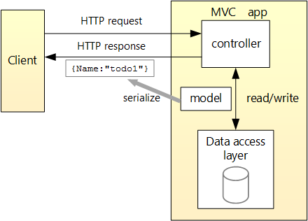

- No menu arquivo , selecione novo > projeto.
Selecione o modelo de API Web do ASP.NET Core e clique em Avançar.

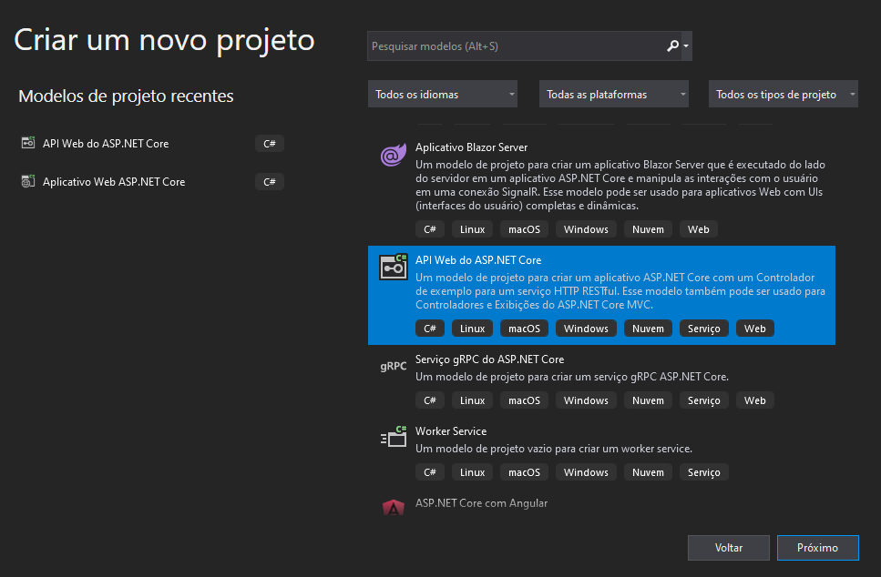

Nomeie o projeto como ApiCartaoVirtual e clique em Criar.

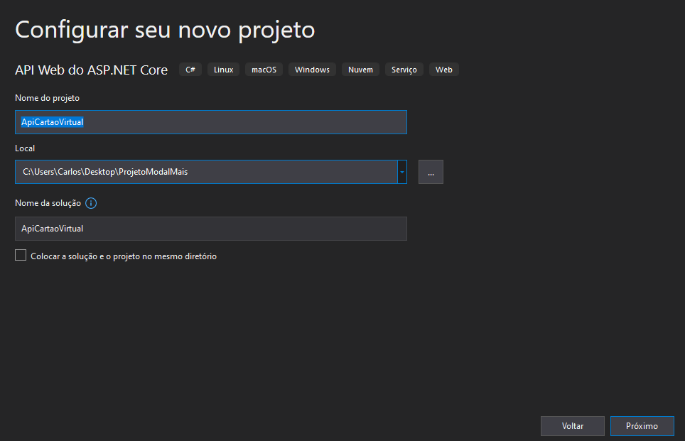

-  Na caixa de diálogo criar um novo ASP.NET Core aplicativo Web , confirme se o .net Core e ASP.NET Core 5,0 estão selecionados. Selecione o modelo API e clique em Criar.

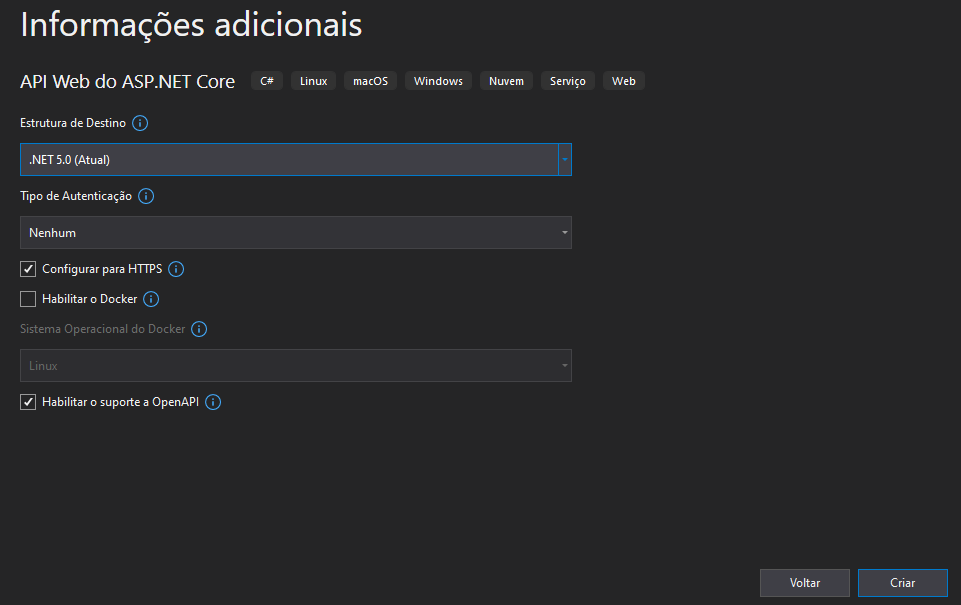

<h3>
Atualizar o launchUrl:
No Properties\launchSettings.jsno, launchUrl atualize de para "swagger" "api/CartaoVirtual" :

</h3>

- No Gerenciador de Soluções, clique com o botão direito do mouse no projeto. Selecione Adicionar > Nova Pasta. Nomeia a pasta Models .

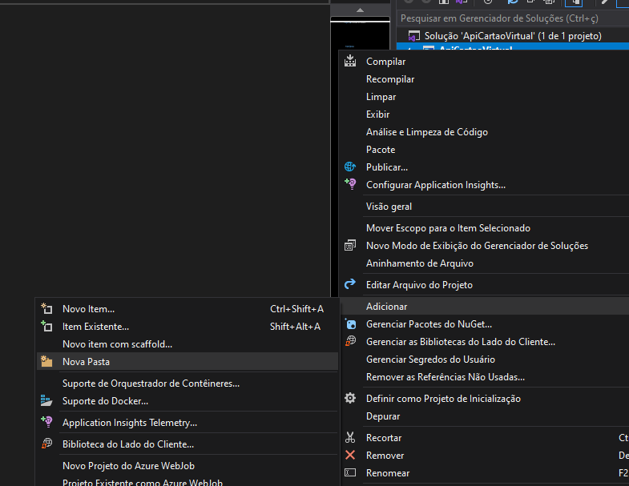
- Clique com o botão direito Models do mouse na pasta e selecione Adicionar > Classe. Dê à classe o nome Cartao e selecione Adicionar.

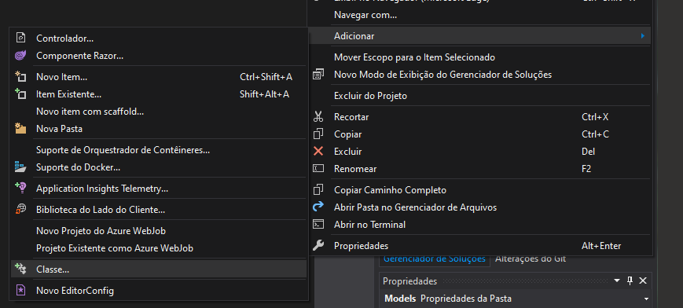

<h3>
Adicionar um contexto de banco de dados
</h3>

 - No menu Ferramentas, selecione Gerenciador de Pacotes do NuGet > Gerenciar Pacotes do NuGet para a Solução.

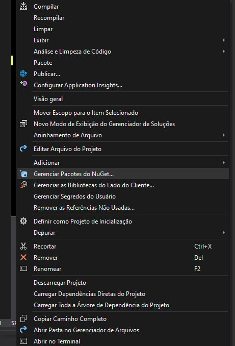

 - Selecione a guia procurar e, em seguida, insira Microsoft.EntityFrameworkCore.InMemory na caixa de pesquisa.

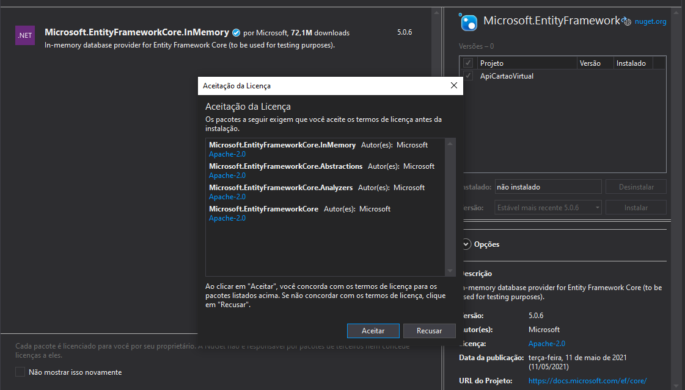
 - Selecione Microsoft.EntityFrameworkCore.InMemory no painel esquerdo.
 - Marque a caixa de seleção projeto no painel direito e, em seguida, selecione instalar

 - Clique com o botão direito do mouse na Models pasta e selecione Adicionar > classe. Nomeie a classe como TodoContext e clique em Adicionar.
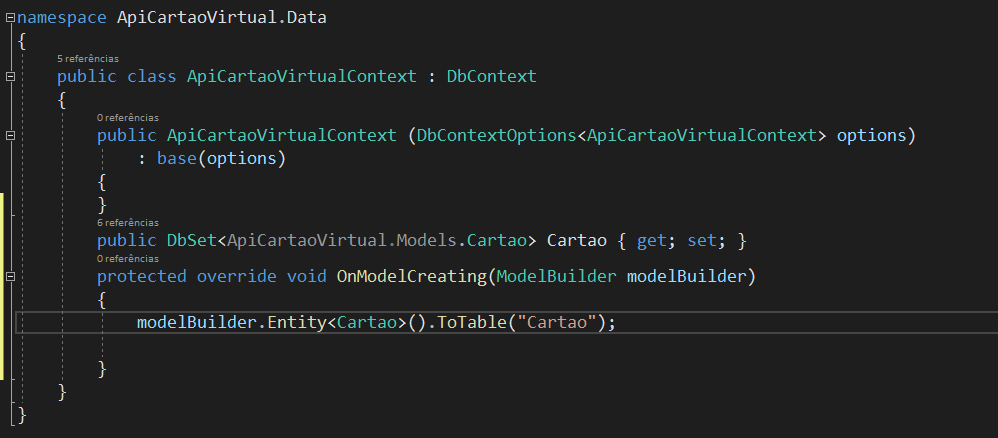

Registrar o contexto do banco de dados
No ASP.NET Core, serviços como o contexto de BD precisam ser registrados no contêiner de DI (injeção de dependência). O contêiner fornece o serviço aos controladores.

Atualize Startup. cs com o seguinte código:

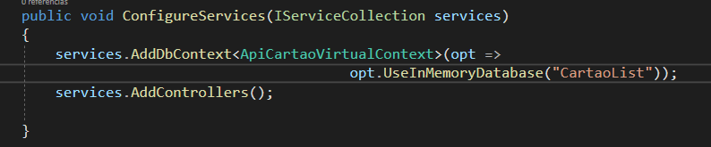

<h3>
Faça scaffold de um controlador
</h3>
- Clique com o botão direito do mouse na pasta Controllers.

 - Selecione Adicionar > Novo item com scaffold.

- Selecione Controlador de API com ações, usando o Entity Framework e, em seguida, selecione Adicionar.

- Na caixa de diálogo Adicionar Controlador de API com ações, usando o Entity Framework:

- Selecione Cartao (Cartao. Models ) na classe Model.
- Selecione ApiCartaoVirtualContext (TodoApi. Models ) na classe de contexto de dados.
- Selecione Adicionar.

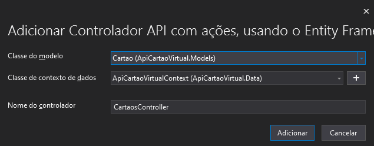

O código gerado:

Marca a classe com o [ApiController] atributo. Esse atributo indica se o controlador responde às solicitações da API Web. Para saber mais sobre comportamentos específicos habilitados pelo atributo, consulte Criar APIs Web com o ASP.NET Core.
Usa a DI para injetar o contexto de banco de dados (ApiCartaoVirtualContext) no controlador. O contexto de banco de dados é usado em cada um dos métodos CRUD no controlador.
Os modelos de ASP.NET Core para:

Os controladores com exibições incluem [action] no modelo de rota.
Os controladores de API não incluem [action] no modelo de rota.
Quando o [action] token não está no modelo de rota, o nome da ação é excluído da rota. Ou seja, o nome do método associado da ação não é usado na rota correspondente.

Instale o Postman
Este tutorial usa o Postman para testar a API Web.

Instalar o Postman
Inicie o aplicativo Web.
Inicie o Postman.
Desabilite a Verificação do certificado SSL
Em Arquivo > Configurações (guia Geral), desabilite Verificação de certificado SSL.

Teste o PostTodoItem com o Postman
Crie uma solicitação.

Defina o método HTTP como POST.

De definir o URI como https://localhost:<port>/api/cartaos . 

Selecione a guia body.

Selecione o botão de opção raw.

Defina o tipo como JSON (aplicativo/json).

No corpo da solicitação, insira JSON para um item pendente:

{
    
    "Email":"carlosanoronha@hotmail.com"
    
  }

  
  
